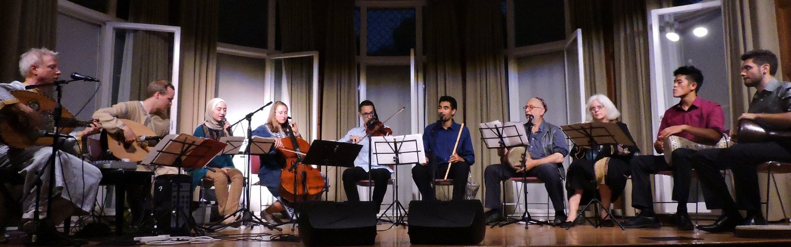

### Welcome

We are Stanford University's ensemble for music from across the Middle East region, with a focus on Arabic, Turkish, and Persian music. We perform regularly both on and off campus.

Our membership is open, and consists of undergrads, grad students, staff, and faculty, as well as members of the broader community. All are welcome, regardless of background or prior experience.

We hold open rehearsals and drink tea together every Wednesday night during term time on the Stanford campus. Join us!

### Upcoming Appearances

**Sunday, March 17, 2019**: Winter Show featuring [Ali Paris](https://www.youtube.com/channel/UC2BkgM7L7WoizzexIZ1xxtw). Show at 3pm, location TBA.

### Contact

Get in touch! We check...
- our email: stanford.middle.east.ensemble@gmail.com
- our [Facebook page](https://facebook.com/StanfordMEE)